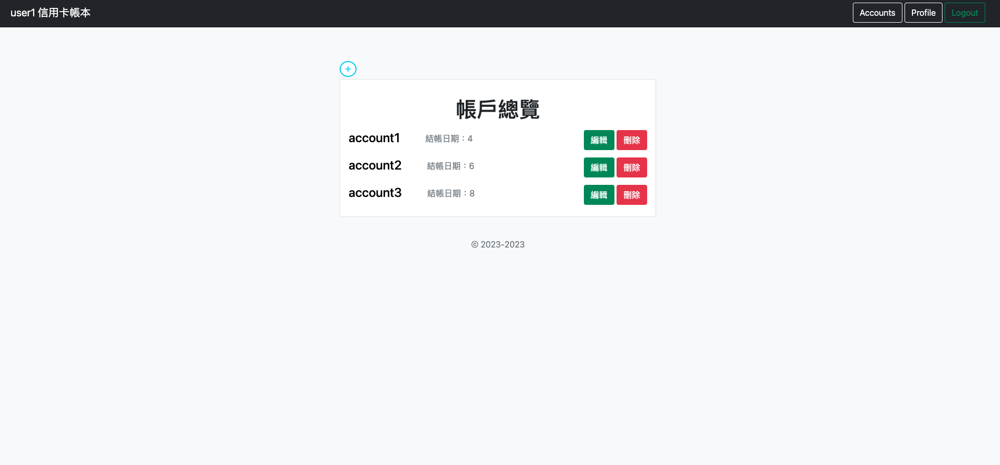

# My expense tracker

## **Introduction 專案簡介**

使用 Node.js + Express + MySQL 製作的簡易信用卡記帳網站，使用者可以註冊帳號、登入，並進行創建帳戶、記錄費用、查詢每月花費，針對每張信用卡結帳日期不同，可以計算每個月花費總額。



### 雲端試用

- 試用連結: https://myexpense-8f3cf0262915.herokuapp.com/signin
- 前台試用帳密
    - 帳號: user1@example.com
    - 密碼: 123456

## **Features 功能**

- 使用者可以註冊，並登入帳號使用網站服務
- 使用者能在首頁新增帳戶
- 使用者能編輯、刪除帳戶
- 使用者能進入每個帳戶新增費用
- 使用者能編輯、刪除費用
- 使用者可以點擊箭頭查詢每隔月總費用
- 使用者能編輯自己的個人資訊

## **Tools & Tech 開發工具及技術**

- VScode
- Git
- Node.js
- nodemon
- MySQL Workbench
- bootstrap
- heroku
- Travis
- CI/CD

## **Installation 開始使用**

```
# 開啟終端機 並 Clone 此專案至本機
$ git clone https://github.com/thpss91103/myExpenseTracker.git

# 於終端機進入存放本專案的資料夾
$ cd xxxxx

# 安裝 npm 套件
$ npm install

# 新增.env檔案，並請根據.env.example檔案內資訊設置環境變數

# 修改 config.json 中的 development 設定，使用個人 MySQL 的 username、password 和 database
  development": {
      "username": "<your username>",
      "password": "<your password>",
      "database": "<your database>",
      "host": "127.0.0.1",
      "dialect": "mysql"
  }

# 新增資料表和種子資料
$ npx sequelize db:migrate
$ npx sequelize db:seed:all

# 啟動伺服器，執行 app.js 檔案
$ npm run dev 

# 若在終端機看到下方訊息代表順利運行，於瀏覽器中輸入該網址(http://localhost:3000)即可開始使用本網站
"App is running on http://localhost:3000"
```